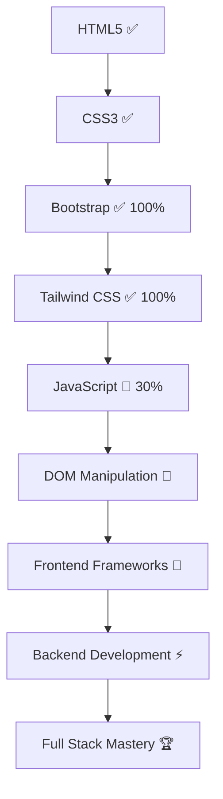

# Chair
#  Funny project more practice on Tailwind Css 
# link of the (Live Demo) 
https://le-chair-git-main-mahmoudfawzy10s-projects.vercel.app/
# 👋 Hey there, I'm **Mahmoud Fawzy**

## 🚀 *Aspiring Full-Stack Developer* | 🎯 *Continuous Learner*

### 📅 **Project: leChair **

*An innovative platform built with Tailwind CSS.*

- 🎓 Tailwind CSS is a modern, utility-first CSS framework that speeds up UI development.
      It offers pre-built utility classes for responsive, customizable, and clean designs.
     Tailwind helps create sleek, maintainable, and fast-loading websites effortlessly.
- 🔄 Smooth, modern UI powered by Tailwind CSS.

---

  

---

### 🛠️ **Tech Stack:**

  
  
  
  
  
  

---

### 📈 **Development Journey:**

---

### 🎯 **Current Goals:**

- 📚 Master JavaScript fundamentals and DOM manipulation.
- 🌟 Advance in Tailwind CSS for sleek responsive designs.
- 🔍 Explore front-end frameworks like React.
- 🏢 Learn database management (MySQL, Oracle, SQLite).
- 🚀 Build real-world projects to enhance problem-solving skills.

---

### 🏧 **Connect With Me:**

  
  

---

### 💡 *"Code, Learn, Repeat! The journey never ends."* 🚀

---

### 🛠 **Latest Updates:**

- 🎯 **JavaScript Fundamentals:** Started learning JavaScript, currently at 25%, focusing on basics like variables, functions, and loops.
- 🌟 **Bootstrap Progress:** Achieved 100% proficiency in Bootstrap, now comfortable with responsive design, utility classes, and components.
- 🎨 **Tailwind CSS:** Started with 25%, learning utility-first classes and modern responsive techniques.
- 🚀 **Next Steps:** Dive deeper into JavaScript, DOM manipulation, Tailwind CSS, and start building interactive projects.

---

### Keep coding and learning! 🚀

